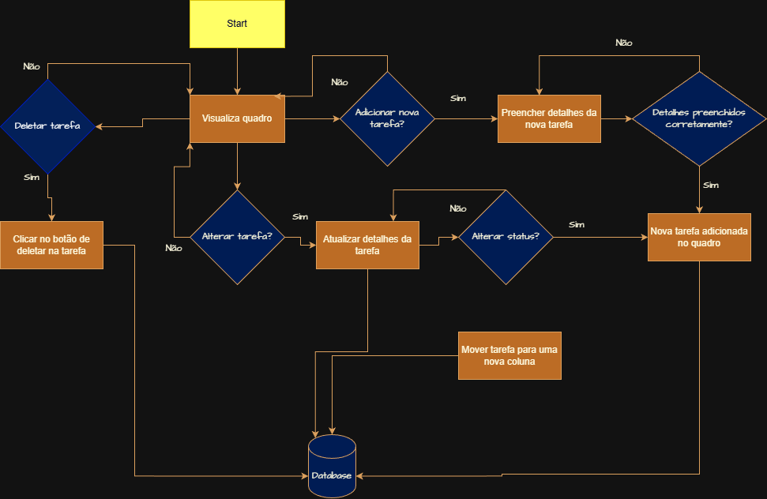
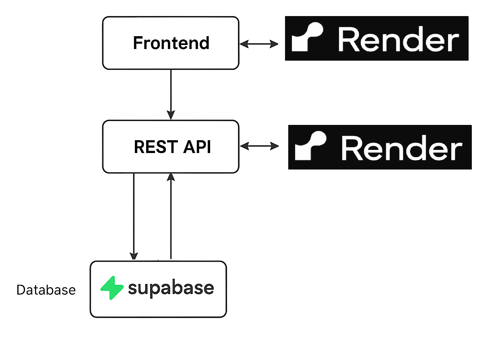

# Desafio Fullstack Veritas – Kanban de Tarefas

Aplicação fullstack composta por:

- **Backend** em Go (Gin) expondo uma API REST para gerenciamento de tarefas.
- **Frontend** em React + Vite, consumindo essa API e exibindo um board Kanban com drag & drop.

---

## Fluxo de uso da aplicação (User Flow)


## Tecnologias principais

### Backend
- Go + Gin
- Gin CORS Middleware (`github.com/gin-contrib/cors`)
- Banco PostgreSQL (Supabase)
- Deploy no Render

### Frontend
- React + Vite
- TypeScript
- Axios
- React Query (@tanstack/react-query)
- @dnd-kit/core (drag and drop do Kanban)
- TailwindCSS
- Deploy no Render

---

## Como rodar o backend

### 1. Pré-requisitos

- Go instalado (>= 1.20)
- Banco PostgreSQL (local ou Supabase)
- Arquivo `.env` configurado na raiz do backend (siga o backend/.env.exemple)

### 2. Instalar dependências

Na pasta do backend:

```bash
go mod tidy
```

### 3. Rodar o servidor localmente

```bash
go run main.go
```

Por padrão, a API ficará acessível em:

```text
http://localhost:8080
```

Principais rotas:

- `GET /tasks/` – Lista todas as tasks do app
- `GET /tasks/:id` – Pega deatalhes de uma task
- `POST /tasks/` – Cria uma task
- `PUT /tasks/:id` – Atualiza uma task
- `DELETE /tasks/:id` – Remove uma task

---

## 💻 Como rodar o frontend

### 1. Pré-requisitos

- Node.js (>= 18)
- NPM ou Yarn

### 2. Variáveis de ambiente (Vite)

Seguindo o arquivo frontend/.env.example, declare as variáveis de ambiente

### 3. Instalar dependências

Na pasta do frontend:

```bash
npm install
# ou
yarn
```

### 4. Rodar em modo desenvolvimento

```bash
npm run dev
# ou
yarn dev
```

Por padrão, a aplicação estará em:

```text
http://localhost:5173
```

---

## ⚙️ Decisões técnicas

### Gin + Clean-ish structure

- Uso do framework Web **Gin** para simplicidade e performance do server-side.
- Rotas agrupadas em `/tasks` para manter a API organizada.
- CORS configurado manualmente para controlar origens de frontend (dev e prod).
- Arquitetura MVC adaptada ao nível de complexidade da aplicação
- Workflow configurado no git para que apenas commits que gerem uma nova versão do app que passe nos testes sejam aceitos


### PostgreSQL (Supabase)

- Postgres pela robustez e facilidade de uso.
- Supabase escolhido como solução gerenciada para reduzir overhead de infra.

### React + Vite + React Query

- **React Query** para:
  - Gerenciar estado assíncrono de tarefas.
  - Cache, refetch, invalidation automático após create/update/delete.

### Arquitetura do Frontend

O frontend segue um padrão MVVC adaptado (Model–View–ViewModel–Controller), que separa responsabilidades entre camadas e mantém a aplicação mais modular e previsível.

### Drag & Drop com @dnd-kit

- `@dnd-kit/core` para implementar Kanban com drag-and-drop:
  - `useDraggable` nos cards
  - `useDroppable` nas colunas
- O drop em outra coluna dispara `moveTask`, que chama `update` no backend.

---

## Fluxo de uso da aplicação (User Flow)


## Limitações conhecidas

- Não há autenticação/controle de usuário:
  - Todas as tarefas são globais, sem multi-usuário.
- Validações no backend ainda são básicas:
  - Campos obrigatórios/dominios de status podem ser melhor validados.
- Não há paginação ou filtros:
  - Todas as tarefas são retornadas de uma vez só.
- Drag & drop:
  - Reordena colunas por status apenas, não há ordenação dentro da mesma coluna (não guarda posição).
- UI sem responsividade:
  - Layout funcional, mas sem design avançado/responsividade, não é um site com uma boa UX do ponto de vista mobile, por exemplo.

---

## Melhorias futuras

- Autenticação (JWT ou sessions) e associação de tarefas a usuários.
- Paginação, busca e filtros (por status, texto, data).
- Campo de prioridade e ordenação manual dentro das colunas.
- Testes automatizados:
  - Backend: testes de handler/service
  - Frontend: testes de componentes/hook (`useTasksViewModel`)
- Melhorar UX do drag-and-drop:
  - Reordenar tarefas dentro da mesma coluna
  - Animações de movimento
- Adicionar estados de loading/erro mais visíveis na UI.
